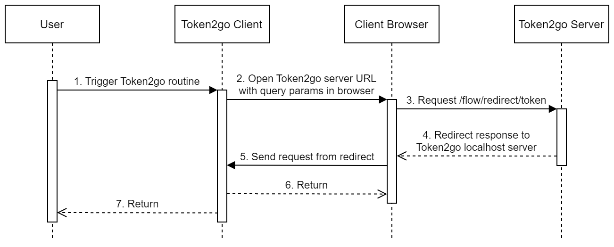

# Token2go Server

The Token2go server is an Augmentation to existing auth schemas that provides
users direct and easy access to tokens and secrets in general. In that regard it
acts as an escape hatch.

It is aimed at scenarios where users want to work directly and interactively
with protected APIs that do not support static secrets or advanced flows like
the OAuth 2.0 device code grant.

For end users, Token2go client libaries (small pieces of code that implement
flows on the client-side) are probably more interesting than the Token2go server
itself.

Two high level features are included:

- **Simple web interface** that presents tokens that are extracted from incoming
  requests to the end user. Includes quality of life features like directly
  copying the token into the user's clipboard.
- **Flows for REPLs** (Jupyter notebooks, small scripts, shells) to
  automatically retrieve tokens without requiring the user to manually copy and
  paste tokens into the respective program.

The Token2go server is supposed to be hosted behind a gateway that performs
authentication and / or authorization and that adds the token to the request
before forwarding it to Token2go.

Remember to only provide token access to clients that can be trusted to handle
tokens directly.

## Use Case Examples

### Retrieve OAuth 2.0 access token via web page

You have an app that provides access to data. The app is using OAuth 2.0 and
OIDC. It includes a web interface using authorization code grant. Other apps are
using your app as a data source. These apps rely on authorization code grant or
client credentials grant in combination with on-behalf-of grant.

Now you have some users that want direct access your app's API from arbitrary
environments like an interactive Jupyter notebook or a small shell script. They
can't use the aforementioned approaches. For example it is not feasible to
provide every user with their own OAuth 2.0 client. But they still need the
access token.

You could add a simple endpoint to your app that extracts tokens from incoming
requests and returns them directly for example as text.

Or you can use the Token2go web interface that also extracts tokes from incoming
requests, but also includes a nice page that includes quality of life features
like directly copying the token into the user's clipboard.

[Here is a video showcasing the web page and it's functionality](assets/2022-11-20-usecase-token-from-web-page.gif)

### Retrieve OAuth 2.0 access token from programs

You have an app that provides access to data. The app is using OAuth 2.0 and
OIDC. It includes a web interface using authorization code grant. Other apps are
using your app as a data source. These apps rely on authorization code grant or
client credentials grant in combination with on-behalf-of grant.

Now you have some users that want to access your app's API from arbitrary
environments like an interactive Jupyter notebook or a small shell script. They
can't use the aforementioned approaches. For example it is not feasible to
provide every user with their own OAuth 2.0 client. The device code grant is not
supported. They still need the access token. They don't want to manually copy
and paste tokens.

One solution: Host the Token2go server. It provides an interface that can be
used by programs that can act as a Token2go client. Your users use a small
library in their interactive program. It leverages a local browser and a
temporary local HTTP server to interact with the Token2go server. Tokens are
redirected securly to the running program using the so called token redirect
flow.

## Getting Started

Tbd.

## Configuration

The Token2go server is configured via environment variables.

### General Core

- `T2G_SERVER_PORT`: Optional port for the server to listen on. Defaults to
  `8080`.

### Token extraction

- `T2G_TOKEN_HEADER_NAMES`: Optional list of header names to look for when
  extracting tokens. List elements separated by commas. Defaults to
  `Access-Token`, `Authorization`, `Token`, `X-Auth-Request-Access-Token`, and
  `X-Forwarded-Access-Token`.
- `T2G_ADD_TOKEN_HEADER_NAMES`: Optional list of additional header names to look
  for when extracting tokens. List elements separated by commas. Unset by
  default.
- `T2G_FALLBACK_TOKEN`: Optional token to use when no token has been extracted.
  Unset by default.

For Token2go to work correctly, `T2G_TOKEN_HEADER_NAMES` or
`T2G_ADD_TOKEN_HEADER_NAMES` must contain the token header name used in your
environment. Check with the `/echo` endpoint.

### User Interface

- `T2G_UI_TARGET`: Optional. Name of the product the Token2go server is used
  with.
- `T2G_UI_TITLE`: Optional. Override the title.
- `T2G_UI_DESC1`: Optional. Override description.
- `T2G_UI_DESC2`: Optional. Add additional second description. Must be valid
  HTML.
- `T2G_UI_MISC`: Optional. Add additional section to bottom. Must be valid HTML.

Setting `T2G_UI_TARGET` should be enough.

## API Endpoints

*This is just a very brief overview over the endpoints provided by Token2go. For
more comprehensive insights check out the Swagger UI and the flow-related
documentation in this README.*

### Core

- `/`: Entrypoint to web page. Calls out to other embedded files.
- `/token`: Get token as a JSON payload. Used by web page script.
- `/swagger-ui`: API schema. Essential to understand and use flows.

### Flows

- `/flow/redirect/token`: Perform the token redirect flow. Encrypted token is
  encoded into the redirect URL pointing at provided target.

### Management

- `/health`: Check health of Token2go server.
- `/echo`: Get an echo of request headers, parameters, and more.

## Token Redirect Flow

Basic idea is that a redirect response is used to get the token from the
Token2go server to the Token2go client (for example a Python script in a Jupyter
notebook). The token is send via query parameters in encrypted form making
transfer secure even without TLS.

Token2go client wants to get a token. The client opens this endpoint in the
user's browser. Among other input, a public key is provided with the URL as part
of the query parameters. The server generates a key and encrypts it with the
provided public certificate. The key is used to encrypt token data. Encrypted
key and data are encoded into query parameters and added to the provided
redirect URL. Finally, the user is redirected. Probably to a server hosted on
localhost by the Token2go client.

There is only one endpoint (`/flow/redirect/token`) used in the token redirect
flow.

Here is how it's supposed to be used and how it works in general:

1. Client setup.
   1. Start up temporary server on localhost.
   1. Generate key pair according to requirments.
   1. Bake input baked into URL query parameters.
   1. Open this endpoint in user's browser.
1. Endpoint processing.
   1. Extract token and stuff.
   1. Generate key for symmetric encryption.
   1. Encrypt key using asymmetric encryption.
   1. Encrypt payload with generated key.
   1. Bake encrypted key and data into URL query parameters.
   1. Return redirect to provided target + query parameters.
1. Receive and process redirection in client.
   1. Base64 decode key, nonce, and payload.
   1. Decrypt key with private key.
   1. Decrypt payload with decrypted key and nonce.
   1. Retrieve token and other data by unmarshalling.

For more information please refer to the OpenAPI specification. For example via
the `/swagger-ui` endpoint or the schema file
[`static/swagger.yaml`](static/swagger.yaml) itself.
